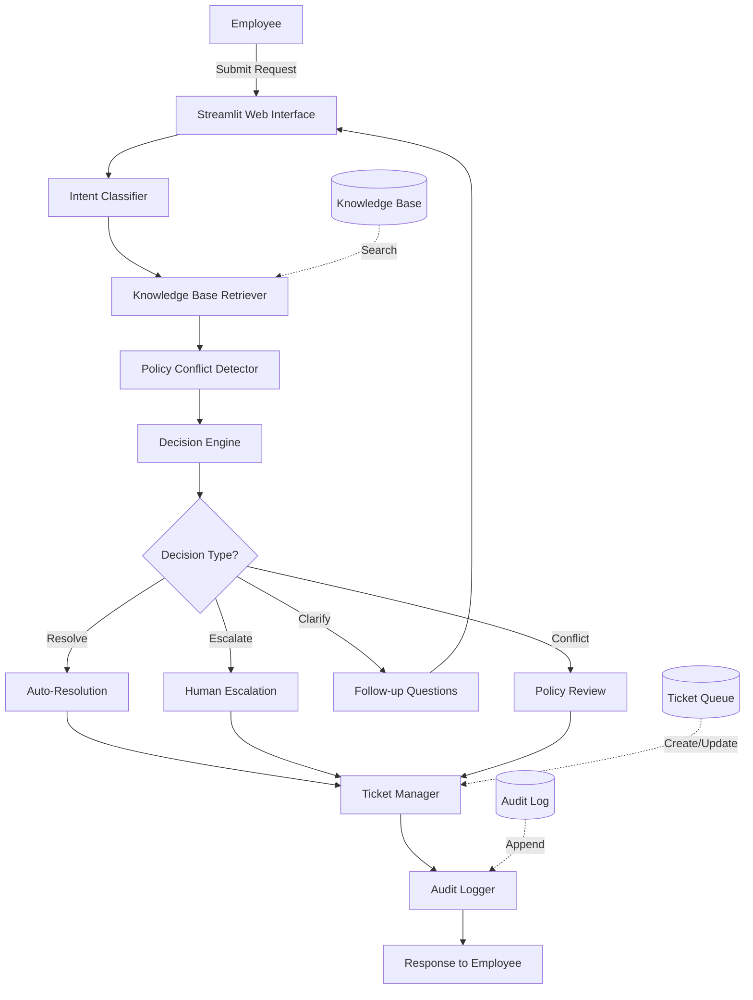

# Veridian IT Support Agent - Architecture Documentation

## System Overview

The Veridian IT Support Agent is an AI-powered internal IT support system that processes employee requests through a multi-stage pipeline, grounds all responses in documented policies, and maintains complete audit trails.

## High-Level Architecture

> **📊 Exportable Version:** Open `architecture_diagram.html` in a browser for a high-resolution, screenshot-ready version of this diagram (suitable for presentations).



## Component Architecture

### 1. Web Interface Layer (Streamlit)

**File**: `app.py`

**Responsibilities**:
- Present chat-style interface for request submission
- Display agent responses with formatting
- Show ticket queue and audit trail
- Load pre-configured test requests

**Key Features**:
- Three-tab interface (New Request, Ticket Queue, Audit Trail)
- Real-time processing feedback
- Expandable sections for detailed information
- Quick-load test scenarios from sidebar

### 2. Intent Classification Layer

**File**: `agent/classifier.py`

**Responsibilities**:
- Parse natural language requests
- Classify into predefined categories
- Extract entities (laptop age, employee type, remote days, etc.)
- Determine if clarification is needed

**Classification Categories**:
- password_reset
- vpn_access
- laptop_hardware
- software_install
- printer_issue
- email_quota
- guest_wifi
- security_incident
- home_office
- access_request
- expense_software
- unclear

**Entity Extraction**:
- Duration (laptop age in years)
- Employee type (full-time vs contractor)
- Remote work days per week
- Urgency level
- Security risk indicators

### 3. Knowledge Base Retrieval Layer

**File**: `agent/kb_retrieval.py`

**Responsibilities**:
- Search KB articles using keyword matching
- Score and rank relevant policies
- Detect policy conflicts
- Return top-k results with context

**Search Strategy**:
1. Keyword matching (2 points per match)
2. Title matching (1 point per word)
3. Content matching (0.5 points per significant word)
4. Sort by score, return top 3

**Conflict Detection**:
- Checks for `conflict_note` field in policies
- Specifically detects KB-03 vs Asset Management Policy conflicts

### 4. Decision Engine Layer

**File**: `agent/decision_engine.py`

**Responsibilities**:
- Analyze request context and KB policies
- Apply business rules for resolution/escalation
- Handle special cases (security, conflicts, unclear requests)
- Generate appropriate instructions

**Decision Actions**:
- `resolve`: Auto-resolve with instructions
- `resolve_with_escalation_option`: Provide guidance, mention escalation option
- `escalate`: Route to approver (Manager, IT, Finance, Security)
- `escalate_security`: Urgent security routing
- `escalate_conflict`: Surface policy conflicts
- `request_clarification`: Ask follow-up questions

**Business Rules**:

| Scenario | Action | Approval Required |
|----------|--------|-------------------|
| Password reset | Auto-resolve | No |
| Guest Wi-Fi | Auto-resolve | No |
| Printer troubleshooting | Auto-resolve (with guidance) | No |
| VPN - Full-time employee | Auto-resolve | No |
| VPN - Contractor | Escalate to Manager | Yes |
| Laptop <3 years, hardware failure | Escalate to IT | Yes |
| Laptop 3+ years | Escalate to IT (conflict detected with Asset Policy) | Yes |
| Non-catalog software | Escalate to Security | Yes (3-5 day review) |
| Mailbox quota increase | Escalate to Manager | Yes |
| Home office (3+ days remote) | Escalate to Manager + Finance | Yes |
| Security incident | Escalate to Security (urgent) | N/A |
| Admin access | Escalate to Security + Manager | Yes |
| Expense software access | Route to Finance | N/A (wrong department) |

### 5. Ticket Management Layer

**File**: `agent/ticket_manager.py`

**Responsibilities**:
- Create new tickets
- Update existing tickets
- Match requests to open tickets
- Determine ticket status
- Persist to JSON storage

**Ticket Schema**:
```json
{
  "id": "TK-1052",
  "employee": "Employee Name",
  "email": "email@veridian-corp.example",
  "issue_summary": "Brief description",
  "status": "Status description",
  "category": "Category",
  "kb_reference": "KB-01, KB-02",
  "created_date": "2026-09-21",
  "request_text": "Original request",
  "decision_action": "resolve|escalate|...",
  "decision_reason": "Reasoning",
  "closed": false
}
```

**Status Determination**:
- Resolved - Auto
- Resolved - Guidance Provided
- Escalated to Security - Urgent
- Pending Review - Policy Conflict
- Pending Security Review
- Pending Finance
- Pending Manager Approval
- Pending IT Review
- Waiting on Employee Response
- Open

### 6. Audit Logging Layer

**File**: `agent/audit_logger.py`

**Responsibilities**:
- Log every request processing event
- Record complete decision chain
- Maintain append-only JSONL log
- Support queries by employee, action, time

**Audit Log Schema**:
```json
{
  "timestamp": "2026-09-21T10:30:00",
  "employee": "Employee Name",
  "email": "email@veridian-corp.example",
  "request": "Original request text",
  "classification": {
    "category": "laptop_hardware",
    "confidence": 0.85,
    "entities": {...}
  },
  "kb_policies_retrieved": [
    {"id": "KB-03", "title": "Laptop Replacement"}
  ],
  "policy_conflicts": ["KB-03 vs Asset Management Policy"],
  "decision": {
    "action": "escalate_conflict",
    "reason": "Policy conflict detected",
    "escalate_to": "IT Management and Finance",
    "kb_sources": ["KB-03", "ASSET-POLICY"]
  },
  "ticket_id": "TK-1052",
  "clarification_questions": []
}
```

## Data Architecture

### Knowledge Base (`data/knowledge_base.json`)

Structure:
```json
{
  "policies": [
    {
      "id": "KB-01",
      "title": "Policy Title",
      "category": "category",
      "content": "Policy text",
      "requires_approval": true|false|"conditional",
      "keywords": ["keyword1", "keyword2"],
      "conflict_note": "Optional conflict description"
    }
  ]
}
```

### Ticket Queue (`data/tickets.json`)

Structure:
```json
{
  "tickets": [...],
  "next_ticket_id": 1052
}
```

### Employee Requests (`data/requests.json`)

Pre-loaded test data with 15 employee requests from assignment.

### Audit Log (`data/audit_log.jsonl`)

Append-only log file (JSON Lines format - one JSON object per line).

## Process Flow

### Happy Path (Auto-Resolution)

1. Employee submits: "I'm locked out of my account"
2. Classifier identifies: `password_reset` (confidence: 0.9)
3. KB Retriever finds: KB-01 (Password Reset)
4. Decision Engine: No conflicts, auto-resolve
5. Ticket Manager: Create TK-1052, status "Resolved - Auto"
6. Audit Logger: Log complete chain
7. Response: Instructions for self-service portal

### Escalation Path (Requires Approval)

1. Employee submits: "New contractor needs VPN access"
2. Classifier identifies: `vpn_access`, entity: `contractor`
3. KB Retriever finds: KB-02 (VPN Access)
4. Decision Engine: Contractor → requires manager approval
5. Ticket Manager: Create TK-1053, status "Pending Manager Approval"
6. Audit Logger: Log decision and reasoning
7. Response: Escalate to manager via access request form

### Conflict Detection Path

1. Employee submits: "Laptop dead, 3.5 years old"
2. Classifier identifies: `laptop_hardware`, entity: `duration=3.5`
3. KB Retriever finds: KB-03 AND ASSET-POLICY
4. Conflict Detector: KB-03 (3 years) conflicts with Asset Policy (4 years)
5. Decision Engine: Surface conflict to human
6. Ticket Manager: Create TK-1054, status "Pending Review - Policy Conflict"
7. Audit Logger: Log conflict details
8. Response: Surface both policies, request human review

### Security Escalation Path

1. Employee submits: "Got phishing email, forwarding to teammates"
2. Classifier identifies: `security_incident`, entity: `security_violation`
3. KB Retriever finds: KB-09 (Security Incident Reporting)
4. Decision Engine: Immediate security escalation + violation warning
5. Ticket Manager: Create TK-1055, status "Escalated to Security - Urgent"
6. Audit Logger: Log with security flag
7. Response: URGENT escalation to security@veridian-corp.example + DO NOT FORWARD warning

### Clarification Path

1. Employee submits: "hey can you help, its not working"
2. Classifier identifies: `unclear` (confidence: 0.3)
3. Decision Engine: Request clarification
4. Response: Ask specific diagnostic questions
5. (Wait for follow-up from employee)

## Security Considerations

### Input Validation
- All user inputs sanitized
- Request length limits enforced
- Email format validation

### Access Control
- Employee authentication required (not implemented in prototype)
- Role-based access for viewing audit logs
- Sensitive data handling for security incidents

### Audit Compliance
- Immutable audit log (append-only)
- Complete decision chain preserved
- Timestamps with timezone
- No deletion of audit records

### Data Privacy
- Employee data handled per privacy policy
- PII in audit logs (requires access control in production)
- Secure storage of credentials and API keys

## Scalability Considerations

### Current Implementation (Prototype)
- Single-instance Streamlit app
- File-based storage (JSON)
- Keyword-based search
- Synchronous processing

### Production Recommendations

**Backend**:
- Replace file storage with PostgreSQL or MongoDB
- Implement Redis caching for KB lookups
- Add message queue (RabbitMQ/Kafka) for async processing
- Separate API service from web frontend

**Search**:
- Implement vector embeddings with Pinecone/Weaviate
- Add LLM integration (GPT-4/Claude) for better NLU
- Semantic search with hybrid keyword+vector approach

**Deployment**:
- Containerize with Docker
- Deploy to Kubernetes for auto-scaling
- Add load balancer for high availability
- Implement blue-green deployments

**Integration**:
- Connect to HR system for employee validation
- Integrate with Jira/ServiceNow for ticket management
- Add Slack/Teams notifications
- Implement email alerts for escalations

**Monitoring**:
- Application performance monitoring (APM)
- Log aggregation (ELK stack)
- Metrics dashboard (Grafana)
- Error tracking (Sentry)

## Testing Strategy

### Unit Tests
- Test each component independently
- Mock external dependencies
- Cover edge cases and error handling

### Integration Tests
- Test full pipeline with sample requests
- Validate KB search accuracy
- Verify ticket creation and updates

### End-to-End Tests
- Test all 15 employee request scenarios
- Validate key requirements:
  - Policy conflict detection
  - Security escalation
  - Auto-resolution
  - Clarification questions

### Performance Tests
- Measure response time for various request types
- Test concurrent user load
- Validate KB search performance

## Metrics and KPIs

### Operational Metrics
- Requests processed per day
- Average processing time
- Auto-resolution rate
- Escalation rate by category

### Quality Metrics
- Classification accuracy
- KB retrieval relevance
- Employee satisfaction scores
- Resolution time by category

### Business Metrics
- IT support ticket reduction
- Time saved per request
- Cost savings vs manual triage
- Employee self-service adoption

## Future Enhancements

1. **Multi-language Support**: Extend to support requests in multiple languages
2. **Voice Interface**: Add speech-to-text for voice requests
3. **Proactive Notifications**: Alert employees of system outages, policy changes
4. **Learning System**: Improve classification based on historical data
5. **Integration Hub**: Connect to more enterprise systems (AD, HRIS, ITSM)
6. **Mobile App**: Native mobile interface for on-the-go support
7. **Chatbot Integration**: Embed in Slack, Teams, or company intranet
8. **Advanced Analytics**: Trend analysis, predictive support, anomaly detection
